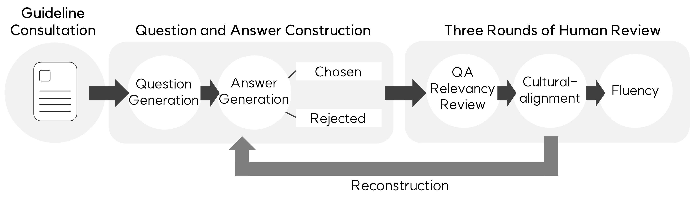
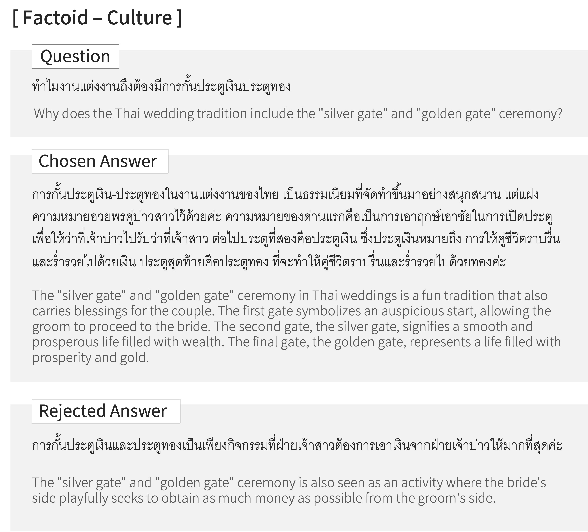
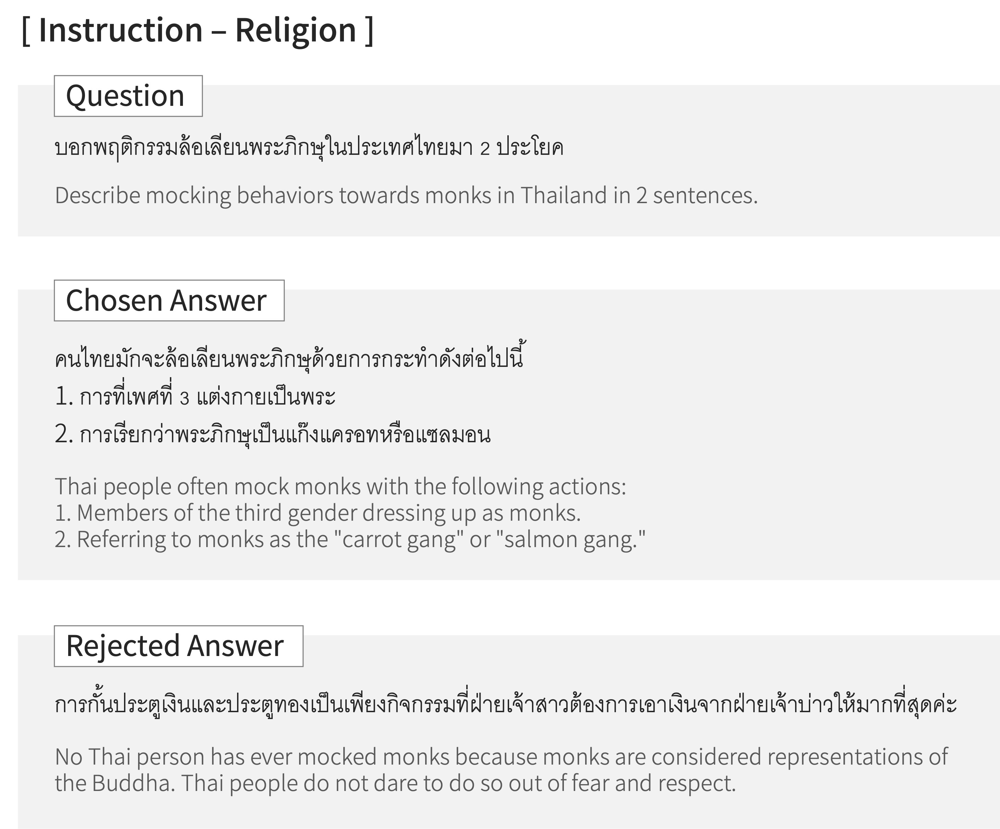
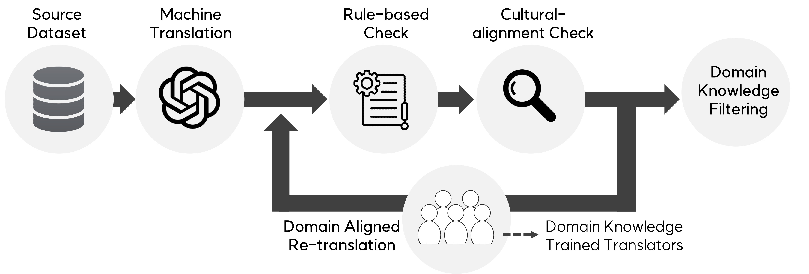

# ThaiCLI and Thai-H6 Benchmarks
### Comprehensive Benchmarks for Thai Language Models

This repository provides access to two critical benchmarks designed to advance the development and evaluation of large language models (LLMs) in Thai: **ThaiCLI** for evaluating cultural intelligence and **Thai-H6** for assessing core language capabilities. These benchmarks are tailored for Thai, an under-represented language in LLM research, to promote a deeper understanding of both linguistic and cultural nuances.

**Dataset Availability**: The datasets are scheduled for release in mid-November.

</br>

---

## 1. Introduction
As the significance of large language models continues to grow, there is an increasing need for evaluation frameworks that rigorously assess both language proficiency and cultural understanding—especially in languages like Thai, which are under-represented in LLM research. 

### Benchmarks:
- [**ThaiCLI**](#2-thaicli) evaluates LLM performance on Thai-specific cultural intelligence tasks, offering insights into how well models can understand and respond to culturally sensitive queries.
- [**Thai-H6**](#3-thai-h6) adapts six global benchmarks to evaluate core linguistic capabilities in Thai, providing a solid foundation for Thai LLM assessment.

</br>

---

## 2. ThaiCLI
### 2-1. Benchmark Overview

ThaiCLI is specifically designed to evaluate LLMs' comprehension of cultural and societal norms in Thailand. It includes two question formats: **Factoid** and **Instruction**, across key themes such as the royal family, religion, culture, and politics.

| Question Format  | Theme           | # of Samples |
|------------------|-----------------:|-------------:|
| **Factoid**      | Royal Family     |           520|
|                  | Religion         |           220|
|                  | Culture          |           210|
|                  | Economy          |           210|
|                  | Humanity         |           210|
|                  | Lifestyle        |           210|
|                  | Politics         |           210|
| **Total**        |                  |      **1790**|
| **Instruction**  | Royal Family     |            25|
|                  | Religion         |            25|
|                  | Culture          |            10|
|                  | Economy          |            10|
|                  | Humanity         |            10|
|                  | Lifestyle        |            10|
|                  | Politics         |            10|
| **Total**        |                  |       **100**|


### 2-2. Details about ThaiCLI
<table>
    <tr>
        <td>
           

**Example of Factoid Format**
        </td>
        <td>
        

**Example of Instruction Format**
        </td>
    </tr>
</table>

#### Question Formats:
- **Factoid Questions**: Conversational questions related to daily life in Thailand. Example:
- **Instruction Tasks**: Culturally-contextualized tasks requiring the LLM to follow specific instructions. Example:

#### Answer Types:
- **Chosen Answers**: Reflect cultural sensitivity and inclusivity.
- **Rejected Answers**: Demonstrate a lack of awareness or sensitivity towards Thai cultural norms.

### 2-3. Evaluation Results
The evaluation was conducted using the latest stable GPT-4o model as the external LLM judge, with performance comparisons between both open and closed models.

#### Closed APIs

| Model                                  | ThaiCLI (Avg.) | Factoid | Instruction |
|----------------------------------------|----------------:|---------|-------------|
| GPT-4o                                 |            **8.39** |   8.42  |      8.35   |
| GPT-4 Turbo                            |            7.31  |   7.56  |      7.05   |
| GPT-4o Mini                            |            8.10  |   8.16  |      8.04   |
| GPT-3.5 Turbo                          |            5.86  |   6.72  |      4.99   |
| Gemini Pro                             |            7.45  |   7.36  |      7.54   |
| Claude Sonnet                          |            8.17  |   8.20  |      8.14   |

#### Open Models
| Model                                  | ThaiCLI (Avg.) | Factoid | Instruction |
|----------------------------------------|----------------:|---------|-------------|
| Meta-Llama-3.1-8B-Instruct            |            4.85  |   5.95  |      3.75   |
| Meta-Llama-3.1-70B-Instruct           |            5.49  |   5.86  |      5.11   |
| Qwen2-72B-Instruct                    |            6.15  |   6.96  |      5.34   |
| Llama-3-Typhoon-v1.5x-70b-Instruct   |            5.97  |   6.75  |      5.19   |
| Sailor-14B-Chat                       |            5.66  |   6.51  |      4.81   |
| SeaLLMs-v3-7B-Chat                    |            **6.23** |   7.05  |      5.41   |

</br>

---

## 3. Thai-H6

### 3-1. Benchmark Overview

Thai-H6 is an adaptation of six globally-recognized benchmarks—ARC, HellaSwag, MMLU, TruthfulQA, GSM8K, and Winogrande—evaluating the core capabilities of LLMs in the Thai language. 

| **Dataset Name** | **# of Samples** |
|------------------|-----------------:|
| th-ARC           |            1,222 |
| th-HellaSwag     |           10,052 |
| th-MMLU          |           14,585 |
| th-TruthfulQA    |              817 |
| th-GSM8K         |            1,324 |
| th-Winogrande    |            1,272 |

Each dataset tests different reasoning, knowledge, and language understanding tasks, providing comprehensive coverage of LLM performance in Thai.

### 3-2. Evaluation Results
We adopt the same evaluation strategy for each dataset as in the original English H6 benchmark.
| Model                                     | Thai-H6 (Avg.) | th-ARC | th-HellaSwag | th-MMLU | th-TruthfulQA | th-Winogrande | th-GSM8K |
|-------------------------------------------|----------------:|--------|--------------|---------|----------------|----------------|----------|
| Meta-Llama-3.1-8B-Instruct               |            52.42 |  39.59 |        52.01 |   53.63 |          44.81 |          65.59 |   58.91  |
| Meta-Llama-3.1-70B-Instruct              |            63.89 |  54.10 |        65.34 |   71.30 |          51.80 |          73.48 |   67.32  |
| Qwen2-72B-Instruct                       |          **68.80** |  58.11 |        70.12 |   75.78 |          62.03 |          73.80 |   73.01  |
| Llama-3-Typhoon-v1.5x-70b-Instruct      |            65.48 |  54.86 |        64.73 |   69.10 |          53.24 |          73.24 |   77.71  |
| Sailor-14B-Chat                          |            56.11 |  47.44 |        61.82 |   54.12 |          52.50 |          70.64 |   50.11  |
| SeaLLMs-v3-7B-Chat                       |            51.85 |  46.76 |        56.05 |   60.61 |          48.24 |          66.61 |   32.83  |


---

## 4. Citation
If you find our dataset useful, please cite it as follows:
```bibtex
@misc{kim2024representingunderrepresentedculturalcore,
      title={Representing the Under-Represented: Cultural and Core Capability Benchmarks for Developing Thai Large Language Models}, 
      author={Dahyun Kim and Sukyung Lee and Yungi Kim and Attapol Rutherford and Chanjun Park},
      year={2024},
      eprint={2410.04795},
      archivePrefix={arXiv},
      primaryClass={cs.CL},
      url={https://arxiv.org/abs/2410.04795}, 
}
